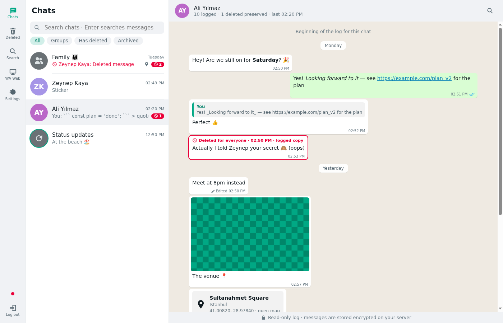
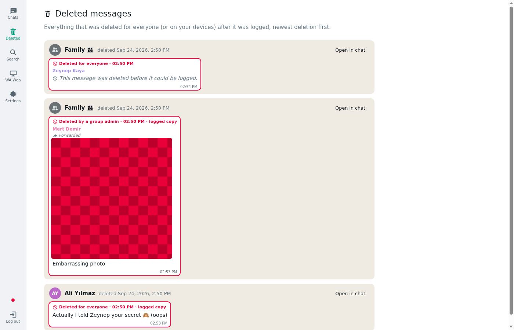
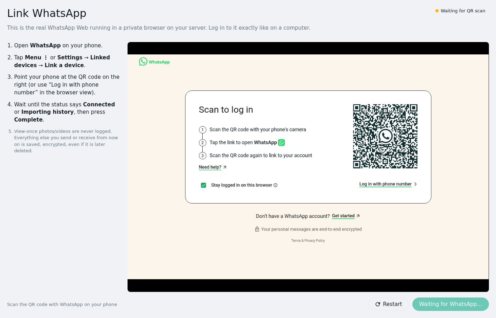
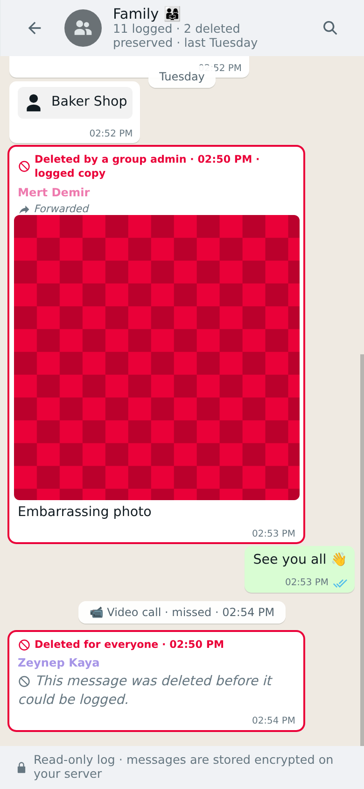

# wa_logger

Self-hosted, **encrypted WhatsApp message logger** with a WhatsApp-like web UI.

wa_logger runs the real WhatsApp Web inside a sandboxed Chromium container on your own server, records every
message, photo, video, voice note, document, edit and reaction your account sends or receives, and keeps it
**even after the sender deletes it**. You read everything in a read-only, WhatsApp-style web interface. You can also
open the live WhatsApp Web session from the menu (**WA Web**).

<p>
  
  
</p>
<p>
  
  
</p>

_(Screenshots show generated demo data.)_

## Features

- **Anti-delete:** messages deleted for everyone (or deleted by a group admin) stay readable and are flagged in red.
  A dedicated **Deleted** page lists every deletion.
- **Edit history:** every earlier version of an edited message is kept.
- **All message types** are logged except view-once media: text with WhatsApp formatting, photos, videos,
  GIFs, voice notes, audio, documents, stickers, locations, contact cards, polls, calls, group events, reactions,
  replies, forwards and status updates (optional).
- **Media is downloaded immediately**, before it can be deleted. Large videos stream to disk in chunks, and playback
  supports seeking (HTTP Range).
- **Search** across all decrypted messages, globally or per chat.
- **WA Web** menu item shows the live background browser (noVNC), view-only by default.
- **Live updates** (Server-Sent Events), light and dark themes, and a mobile layout.

**View-once photos and videos are not logged, by design.** They appear only as a placeholder.

## Security at a glance

This app handles private messages, so security was the primary design constraint. See [SECURITY.md](SECURITY.md)
and [ARCHITECTURE.md](ARCHITECTURE.md) for details.

- **Encryption at rest with your password.** Message text, names, thumbnails and every media file are encrypted
  (AES-256-GCM) under data keys that are wrapped to an X25519 key pair. The private key itself is encrypted with
  your password (scrypt). The logger can *write* while you are logged out, but a stolen database, media folder
  or backup **cannot be read** without your password or recovery key.
- **Single owner.** Signup needs the one-time `SETUP_TOKEN` from `.env`, and signup closes after the first account.
  Optional **TOTP 2FA**, a recovery key, per-account lockout, rate limits and an audit log are included.
- **Hardened sessions.** `__Host-` cookies (`Secure`, `HttpOnly`, `SameSite=Strict`) plus Origin and CSRF-token
  checks, with idle and absolute expiry. Sessions can be listed and revoked, including "log out everywhere".
- **Strict CSP** (no inline scripts, no third-party resources). Message content is never rendered as HTML.
  Attacker-sent files are served with a sandbox CSP and as downloads unless they are safe image, audio or video types.
- **Isolated containers.** The app container has **no internet access**. Only Chromium can reach WhatsApp, and its
  remote-debugging and VNC ports are reachable only on an internal Docker network. Chromium keeps its **sandbox on**
  (through a custom seccomp profile) and a policy blocks navigation to any site except WhatsApp, as well as
  downloads, uploads and extensions. All containers run non-root with read-only root filesystems, `cap_drop: ALL`
  and `no-new-privileges`.

> ⚠️ wa_logger uses an unofficial WhatsApp Web client (`whatsapp-web.js`). Automating WhatsApp may break its Terms of
> Service and could get the account restricted. Use it only for your own account and at your own risk. Laws about
> recording communications differ by country.

## Requirements

- Linux host with **Docker Engine 24+** and the **compose plugin** (v2).
- 2 GB RAM minimum (**4 GB recommended**). Chromium with WhatsApp Web uses about 0.5–1 GB.
- x86_64 (arm64 should work but is untested).
- Proxmox/LXC works. The container needs `nesting=1` (and `keyctl=1` if unprivileged) so Docker can run inside it.

## Install (Docker Compose)

There are two ways to deploy. Both give you the same three containers (`caddy`, `app` and `chromium`) and the same security settings.

### Option A: prebuilt images (no clone, no build)

Images are published to GitHub Container Registry by CI:
`ghcr.io/revocx35/wa_logger-app`, `…-chromium` and `…-caddy`, tagged `latest`, `x.y.z` and `sha-…`.

```bash
mkdir wa_logger && cd wa_logger
curl -fsSLO https://raw.githubusercontent.com/revocx35/wa_logger/main/deploy/docker-compose.yml
curl -fsSLO https://raw.githubusercontent.com/revocx35/wa_logger/main/chromium/seccomp-chromium.json
curl -fsSLO https://raw.githubusercontent.com/revocx35/wa_logger/main/scripts/setup.sh
bash setup.sh --site 192.168.1.50     # your server's IP or domain; writes .env with random secrets
docker compose up -d
```

The folder then contains exactly these files:

```
wa_logger/
├── docker-compose.yml       # below
├── seccomp-chromium.json    # Docker's default seccomp profile + what Chromium's sandbox needs
├── setup.sh                 # only needed once
└── .env                     # generated secrets and settings (chmod 600)
```

<details>
<summary><b>Example <code>docker-compose.yml</code></b> (same as <a href="deploy/docker-compose.yml">deploy/docker-compose.yml</a>)</summary>

```yaml
# wa_logger — standalone deployment with prebuilt images (no git clone, no build).
#
#   mkdir wa_logger && cd wa_logger
#   curl -fsSLO https://raw.githubusercontent.com/revocx35/wa_logger/main/deploy/docker-compose.yml
#   curl -fsSLO https://raw.githubusercontent.com/revocx35/wa_logger/main/chromium/seccomp-chromium.json
#   curl -fsSLO https://raw.githubusercontent.com/revocx35/wa_logger/main/scripts/setup.sh
#   bash setup.sh --site 192.168.1.50        # writes .env with random secrets (see README)
#   docker compose up -d
#
# Services:
#   caddy    : TLS termination, the only service with published ports
#   app      : Node server + web UI (no internet access: internal networks only)
#   chromium : WhatsApp Web in a sandboxed, policy-locked Chromium (only this talks to WhatsApp)
# Pin a release with WAL_VERSION=x.y.z in .env (default: latest).

name: wa_logger

x-logging: &logging
  driver: json-file
  options:
    max-size: "10m"
    max-file: "3"

x-hardening: &hardening
  read_only: true
  cap_drop: [ALL]
  security_opt:
    - no-new-privileges:true
  logging: *logging

services:
  caddy:
    image: ghcr.io/revocx35/wa_logger-caddy:${WAL_VERSION:-latest}
    restart: unless-stopped
    <<: *hardening
    cap_add: [NET_BIND_SERVICE]
    ports:
      - "${HTTP_PORT:-80}:80"
      - "${HTTPS_PORT:-443}:443"
    environment:
      SITE_ADDRESS: ${SITE_ADDRESS:?create .env first (bash setup.sh)}
      CADDY_TLS: ${CADDY_TLS:-internal}
    volumes:
      - caddy_data:/data
      - caddy_config:/config
    tmpfs:
      - /tmp:rw,noexec,nosuid,nodev,size=16m
    networks: [public, edge]
    depends_on:
      app:
        condition: service_healthy
    mem_limit: 256m
    pids_limit: 128

  app:
    image: ghcr.io/revocx35/wa_logger-app:${WAL_VERSION:-latest}
    restart: unless-stopped
    <<: *hardening
    env_file:
      - .env
    environment:
      DATA_DIR: /data
      PORT: "8080"
      HOST: 0.0.0.0
      CHROMIUM_HOST: chromium
      TRUST_PROXY: "true"
    volumes:
      - app_data:/data
    tmpfs:
      - /tmp:rw,noexec,nosuid,nodev,size=64m
    networks: [edge, backend]
    depends_on:
      chromium:
        condition: service_healthy
    mem_limit: 1g
    pids_limit: 256

  chromium:
    image: ghcr.io/revocx35/wa_logger-chromium:${WAL_VERSION:-latest}
    restart: unless-stopped
    read_only: true
    cap_drop: [ALL]
    security_opt:
      - no-new-privileges:true
      # Docker's default profile + the syscalls Chromium's namespace sandbox needs (sandbox stays ON).
      # Download it next to this file (see the header).
      - seccomp=./seccomp-chromium.json
    logging: *logging
    environment:
      VNC_PASSWORD: ${VNC_PASSWORD:?create .env first (bash setup.sh)}
      SCREEN: ${SCREEN:-1280x800x24}
      BACKEND_PEER: app
    volumes:
      - chromium_profile:/data
    tmpfs:
      - /tmp:rw,nosuid,nodev,size=512m
      - /home/chrome:rw,nosuid,nodev,size=256m,uid=10002,gid=10002,mode=0700
    shm_size: 1gb
    networks: [backend, egress]
    mem_limit: 2500m
    pids_limit: 1024
    stop_grace_period: 20s


networks:
  public: {}
  edge:
    internal: true
  backend:
    internal: true
  egress: {}

volumes:
  app_data: {}
  chromium_profile: {}
  caddy_data: {}
  caddy_config: {}
```

</details>

Example `.env` (generated by `setup.sh`. See [.env.example](.env.example) for every option):

```dotenv
SITE_ADDRESS=192.168.1.50            # domain or IP you open wa_logger at
CADDY_TLS=internal                   # "internal" (self-signed, LAN) or your e-mail for Let's Encrypt
HTTPS_PORT=443
HTTP_PORT=80
PUBLIC_ORIGIN=https://192.168.1.50   # exact browser origin (add :port if not 443)
SETUP_TOKEN=<32 random characters>   # asked once on the signup page
VNC_PASSWORD=<24 random characters>
# WAL_VERSION=1.0.0                  # pin a release instead of "latest"
```

Update with `docker compose pull && docker compose up -d`.

### Option B: build from source

```bash
git clone https://github.com/revocx35/wa_logger.git
cd wa_logger
scripts/setup.sh --site 192.168.1.50
docker compose up -d --build        # uses the repository's docker-compose.yml, which builds all images locally
```

Update with `git pull && docker compose up -d --build`.

### Optional: cap storage with a dedicated disk

Logged media can grow large. To give wa_logger a hard size limit, put its volumes on their own
filesystem (a separate disk, partition or LVM volume) and bind them with a `docker-compose.override.yml`
next to `docker-compose.yml`. Compose merges it automatically:

```bash
# example with LVM: 50% of the volume group's free space
lvcreate -n wa_logger -l 50%FREE ubuntu-vg && mkfs.ext4 -L wa_logger /dev/ubuntu-vg/wa_logger
mkdir -p /srv/wa_logger && echo "LABEL=wa_logger /srv/wa_logger ext4 defaults,noatime,nodev,nosuid 0 2" >> /etc/fstab && mount /srv/wa_logger
install -d -m 700 /srv/wa_logger/{app_data,chromium_profile,caddy_data,caddy_config}
chown 10001:10001 /srv/wa_logger/app_data && chown 10002:10002 /srv/wa_logger/chromium_profile
```

```yaml
# docker-compose.override.yml
volumes:
  app_data:         { driver: local, driver_opts: { type: none, o: bind, device: /srv/wa_logger/app_data } }
  chromium_profile: { driver: local, driver_opts: { type: none, o: bind, device: /srv/wa_logger/chromium_profile } }
  caddy_data:       { driver: local, driver_opts: { type: none, o: bind, device: /srv/wa_logger/caddy_data } }
  caddy_config:     { driver: local, driver_opts: { type: none, o: bind, device: /srv/wa_logger/caddy_config } }
```

The app pauses media downloads when that filesystem has less than 2 GB free, so the database always has room.

### `setup.sh` options

| Situation | Command |
|---|---|
| LAN / IP address (self-signed CA from Caddy) | `setup.sh --site 192.168.1.50` |
| Public domain with Let's Encrypt | `setup.sh --site wa.example.com --email you@example.com` |
| Other ports | `--https-port 8443 --http-port 8080` |

With a public domain, the DNS name must point to the server and ports 80 and 443 must be reachable for Let's Encrypt.
For a home setup, the safest option is to **keep it on your LAN or VPN** (for example WireGuard or Tailscale) and not expose it to the internet.

## First run

1. Open the address that `setup.sh` printed (for example `https://192.168.1.50`). With `internal` TLS your browser shows a
   certificate warning once. You can trust Caddy's root certificate instead:
   `docker compose cp caddy:/data/caddy/pki/authorities/local/root.crt ./caddy-root.crt`
2. **Sign up.** Enter the *setup token* (it is in `.env`), a username and a strong password (12+ characters).
3. **Save the recovery key.** It is shown once and is the only way back in if you forget your password.
   Without both the password and the recovery key, the encrypted log is unrecoverable, by design.
4. **Link WhatsApp.** The page shows the live WhatsApp Web screen. On your phone, open
   **WhatsApp → Linked devices → Link a device** and scan the QR code.
5. When the status shows **Connected** (or **Importing history**), press **Complete**.

From now on every new message is logged. On first link, the last `HISTORY_PER_CHAT` (default 200) messages per chat
are imported from WhatsApp Web as well.

## Using it

| Menu | What it does |
|---|---|
| **Chats** | WhatsApp-style chat list (filters: groups, chats with deleted messages, archived) and the chat view |
| **Deleted** | Every message that was deleted after it was logged, newest first, with a link into its chat |
| **Search** | Full-text search over decrypted messages, captions, polls, locations and contact names |
| **WA Web** | Live view of the background WhatsApp Web (view-only toggle, restart, unlink) |
| **Settings** | Password, 2FA, recovery key, sessions, logging options, security log, wipe data |

In a chat, deleted messages have a **red frame** and the time they were deleted. Edited messages show an
**Edited** link that opens the edit history. Media that could not be downloaded shows the reason and a **Retry** button.

## What gets logged, and the limits

- Messages are captured **while the stack is running and WhatsApp is linked**. After downtime, a reconcile pass
  (on reconnect and every `RECONCILE_MINUTES`) re-reads recent messages and picks up missed messages and deletions,
  as long as WhatsApp Web still has them.
- A message deleted **before** wa_logger saw it cannot be recovered. It shows as "deleted before it could be logged".
- Media larger than `MEDIA_MAX_MB` (default 100 MB, changeable in Settings) is not downloaded automatically. It can be
  retried later while WhatsApp still has it.
- View-once media is never logged.
- If the phone unlinks the device, a banner appears. Relink from **WA Web**.

## Operations

```bash
docker compose ps                 # health
docker compose logs -f app        # app logs (never contain message content)
docker compose pull && docker compose up -d   # update (prebuilt images; from source: git pull && docker compose up -d --build)
docker compose down               # stop (data stays in Docker volumes)
```

**Backups.** Back up the Docker volumes:

- `wa_logger_app_data`: database and media. **Encrypted.** Useless without your password or recovery key.
- `wa_logger_chromium_profile`: **the live WhatsApp session.** Anyone holding it can use your WhatsApp account.
  Protect it like a password, or skip it and relink after a restore.
- `.env`: secrets (setup token, VNC password).

```bash
docker run --rm -v wa_logger_app_data:/data -v "$PWD":/backup debian:trixie-slim \
  tar czf /backup/wa_logger-app-$(date +%F).tgz -C /data .
```

**Reset / uninstall:** `docker compose down -v` deletes **everything**: logs, media and the WhatsApp session.

## Troubleshooting

| Symptom | Fix |
|---|---|
| Browser certificate warning | Expected with `CADDY_TLS=internal`; trust Caddy's root cert (see First run). |
| "Cross-origin request rejected" | Open exactly the `PUBLIC_ORIGIN` from `.env` (same scheme, host and port). |
| Chromium unhealthy, logs mention "No usable sandbox" | Your Docker ignores the seccomp profile, or user namespaces are disabled on the host (`sysctl kernel.unprivileged_userns_clone=1`). As a last resort only: `CHROMIUM_NO_SANDBOX=1` (not recommended). |
| Status stuck at "Starting" | `docker compose logs chromium app`; check that the chromium container can reach `web.whatsapp.com`. |
| WhatsApp says "open in another window" | wa_logger takes the session over automatically. If it persists, press **Restart** on the WA Web page. |
| Lost password | Use **Forgot your password?** on the login page with your recovery key. |
| Custom reverse-proxy settings | Mount your own Caddyfile: `volumes: [./Caddyfile:/etc/caddy/Caddyfile:ro]` on the `caddy` service. |

## Development

```bash
cd server && PUPPETEER_SKIP_DOWNLOAD=true npm ci && npm test && npm run typecheck
cd web && npm ci && npm test && npm run build
scripts/smoke.sh            # full stack end-to-end test in an isolated compose project (22 checks)
scripts/smoke.sh --deploy   # same checks against deploy/docker-compose.yml from an empty directory
```

Useful docs: [ARCHITECTURE.md](ARCHITECTURE.md) (design), [progress.md](progress.md) (build checklist),
[SECURITY.md](SECURITY.md) (threat model), [docs/wwebjs-notes.md](docs/wwebjs-notes.md) (WhatsApp integration notes).
