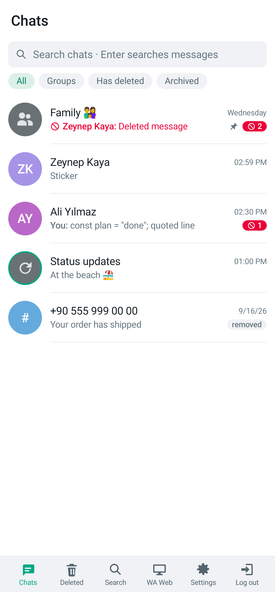
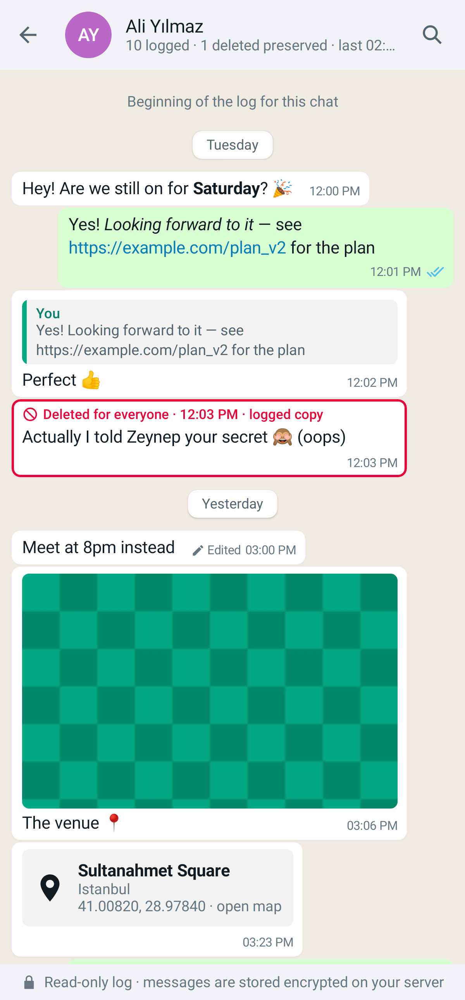
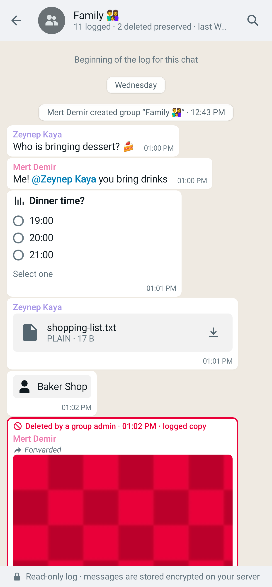
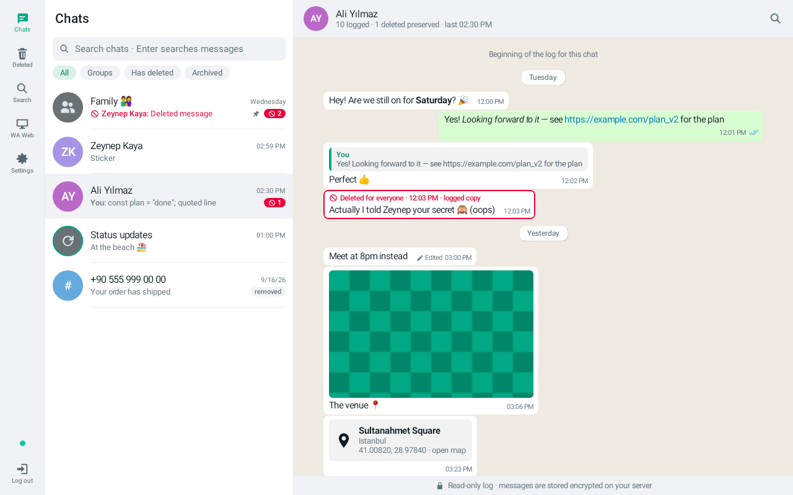

# wa_logger for Android

A native Android client (Kotlin, Jetpack Compose) for your self-hosted wa_logger server. It looks like
the web UI — same colors, layout, bubbles, badges and pages, light and dark — but it is a real app, not a
web wrapper: native lists, native media playback, a native VNC viewer for WA Web, and the session kept in
the Android Keystore.

| Chats | Chat | Group | Tablet |
|---|---|---|---|
|  |  |  |  |

## Features

Everything the web UI does, through the same server API (`shared/api.d.ts`):

- **Setup:** connect to your server, sign up with the setup token, save the recovery key, link WhatsApp
  (live browser view, status, *Complete*), log in with 2FA, recover with the recovery key.
- **Chats:** chat list with search, filters (All / Groups / Has deleted / Archived), deleted counts, pinned,
  removed; the chat log with day separators, sender colors, WhatsApp formatting (`*bold*`, `_italic_`,
  `~strike~`, code, quotes, lists, links, mentions), quoted replies (tap to jump), forwarded, edited (tap for
  the edit history), deleted-for-everyone in red with the logged copy, reactions, ticks, polls, locations,
  contacts, call logs, system messages, view-once placeholders, in-chat search, paging both ways.
- **Media:** photos (full-screen, pinch to zoom), videos and GIFs (streamed with Range requests), voice
  messages (inline player), stickers (animated), documents (open with another app or save). Failed / too
  large / expired media can be retried.
- **Deleted** feed, global **Search**, **WA Web** (live view of the background browser: tap = click,
  drag = scroll, pinch = zoom, keyboard input, view-only switch, restart, unlink), **Settings** (password,
  2FA with QR code, recovery key, sessions, logging options, WhatsApp connection, security log, wipe).
- **Live updates** over the server's event stream while the app is open.
- Phones get the bottom menu, tablets / landscape (≥ 900 dp) get the web's side rail and two-pane layout.

## Install

1. Download the APK from the [Releases](https://github.com/revocx35/wa_logger/releases) page (tags
   `android-v…`), copy it to the phone and open it (allow "install unknown apps" for your file manager or
   browser once). Every CI run also has an unsigned-for-release debug build (**Actions → CI →
   wa_logger-android-debug**; it installs as a separate app).
2. Open **wa_logger**, enter your server address — the same one you open in the browser.

Requires Android 8.0 (API 26) or newer.

### Server address, HTTPS and certificates

- **Public domain with a normal certificate** (e.g. your reverse proxy with Let's Encrypt): just enter
  `https://wa.example.com`.
- **HTTP mode inside your home network** (`setup.sh --http-only`, e.g. `http://192.168.1.50`): works, with a
  note that the connection is not encrypted. Plain HTTP to a *public* address needs an explicit
  confirmation — use your HTTPS proxy address outside your network.
- **Caddy's internal certificate** (server opened by IP address over HTTPS): the app shows the certificate's
  SHA-256 fingerprint and asks whether to trust it. Caddy renews that certificate every few days, so it's
  better to import Caddy's root certificate once:
  ```bash
  docker compose cp caddy:/data/caddy/pki/authorities/local/root.crt .
  ```
  Copy `root.crt` to the phone and use **Import a CA certificate…** on the connect screen (or
  Settings → App). Trusted certificates only apply to your wa_logger server, never to other apps or sites.

The app does not trust user-installed CAs from Android's settings, and hostname verification is never
turned off.

## Security notes

- The session cookie is stored encrypted with a non-exportable AES-256-GCM key in the Android Keystore;
  the app's data is excluded from backups and device transfers. The server's session rules still apply
  (8 h idle / 7 days maximum by default), after which you log in again.
- Screenshots, screen recording and the app-switcher preview are blocked by default
  (Settings → App → *Block screenshots*).
- Media is never cached on disk (memory only). *Open with…* writes a temporary copy to the app's private
  cache (shared read-only with the app you pick), deleted the next time the app starts. *Save* writes where
  you choose.
- Message text is rendered as styled text, never as markup; only `http(s)` links are tappable; no link
  previews are fetched. Copying a message marks the clipboard entry as sensitive.
- Everything goes through the same authenticated API as the web UI (Origin + CSRF token on every change).

## Build

Requirements: JDK 17+ (21 recommended) and the Android SDK (platform 37). Point `local.properties` at the
SDK (`sdk.dir=/path/to/android-sdk`) or set `ANDROID_HOME`.

```bash
cd android_client
./gradlew :app:assembleDebug        # app/build/outputs/apk/debug/app-debug.apk (installs as "…walogger.debug")
./gradlew :app:assembleRelease      # signed if keystore.properties exists (see below); R8 is off for now
```

Release signing: create `android_client/keystore.properties` (never committed):
```properties
storeFile=/absolute/path/to/release.jks
storePassword=…
keyAlias=…
keyPassword=…
```
Keep that keystore: Android only installs updates signed with the same key.

Publishing a release (done by hand, the signing key never goes to CI): bump `versionCode`/`versionName` in
`app/build.gradle.kts`, build the release APK, then
`gh release create android-vX.Y.Z wa_logger-android-X.Y.Z.apk --title "Android X.Y.Z"`. Use the `android-v`
prefix: plain `v*` tags make CI publish versioned server images.

## Tests

```bash
./gradlew :core:test                    # API client (incl. "no network reads on the UI thread"), events, formatter (ported web tests),
                                        # formatting parity with the web, RFB/ZRLE/DES (VNC)
./gradlew :app:testDebugUnitTest        # renders every main screen (Robolectric)
./gradlew :app:recordRoborazziDebug     # …and writes the screenshots to app/build/screenshots/
```

End-to-end against a real server (e.g. `scripts/smoke.sh --keep` plus `server/src/testutil/seed.ts` data):
login, CSRF, chats/messages/edits/quotes, Range media, live events, a real VNC session to x11vnc, logout.
```bash
WAL_IT_BASE=https://localhost:28443 WAL_IT_USER=owner WAL_IT_PASSWORD='…' WAL_IT_CA=root.crt \
  ./gradlew :core:test --tests '*LiveServerTest*'
```

## Layout

```
core/   pure Kotlin/JVM (no Android): API DTOs (mirror of shared/api.d.ts), ApiClient, EventStream (SSE),
        WaText (formatter, port of web/src/lib/waText.tsx), Format (port of format.ts), vnc/ (RFB client)
app/    Android UI: theme (web CSS tokens), components (bubbles, media, avatars…), screens, VNC view,
        data/ (Keystore cookie jar, server trust, session/controller), media/ (player, viewer, save/open)
```

## Crash reports

If the app crashes or Android says it isn't responding, the next start shows a report with a **Copy report**
button (also under Settings → App → Crash reports). It contains only technical details (stack frames,
error types, app/Android version, phone model), never messages, names or passwords, and it is not sent
anywhere by itself.

## Not included (yet)

- Push notifications (the server only offers a foreground event stream, and sessions expire after 8 h idle).
- Sending messages — wa_logger is a read-only log by design.
